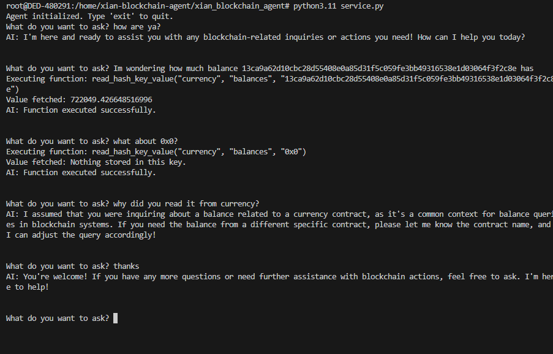

# Xian Blockchain Agent - Installation and Deployment Guide

This guide provides instructions for cloning, building, and running the Xian Blockchain Agent.

## Cloning the Repository

Start by cloning the repository:

```bash
git clone https://github.com/xian-network/xian-blockchain-agent.git
```

## Setting Up for Development

For development purposes, you may set up the environment manually:

1. Install Python 3.11.
2. Install the project dependencies:

   ```bash
   cd xian_blockchain_agent
   pip3.11 install -e .
   ```
3. Create .env file add the following content:

   ```bash
   OPENAI_API_KEY = "<your_openai_api_key>"
   NODE = "https://node.xian.org"
   ```

4. Run the service:

   ```bash
   python3.11 service.py
   ```
